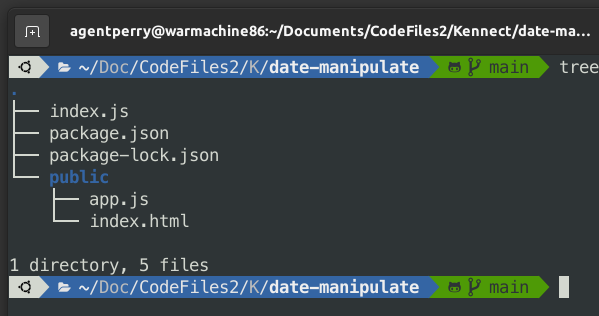
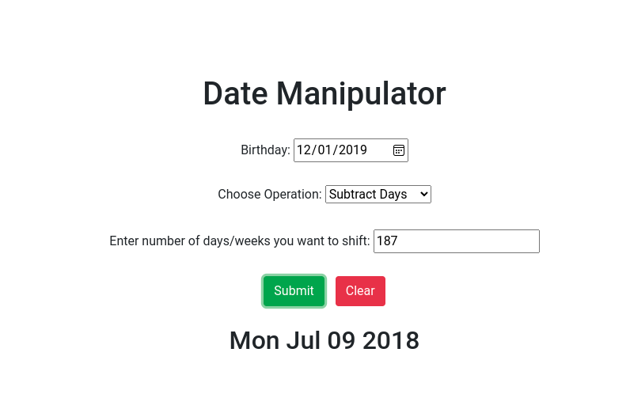
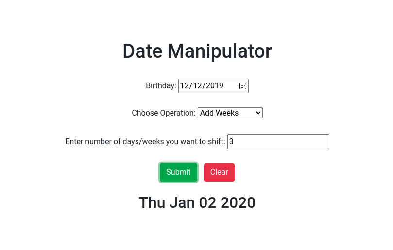

# date-manipulator

## Use
1. It can be used to travel n days/weeks ahead of some given provided date.
2. Vist on this link: [https://date-manipulator.herokuapp.com/](https://date-manipulator.herokuapp.com/) to try and test it out!

## Technology
1. It uses add-subtract-date npm package. 
2. Link to npm package: [https://www.npmjs.com/package/add-subtract-date](https://www.npmjs.com/package/add-subtract-date)

## FileSystem

## Example Screenshots

